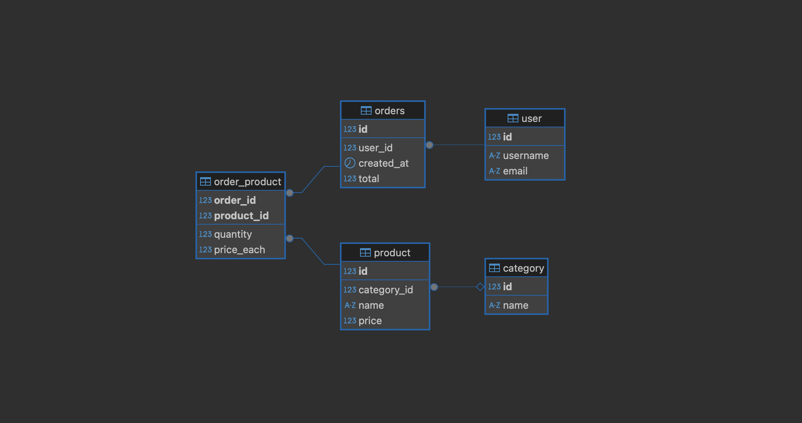

# 🧩 Express.js & MySQL API Project

This is a backend project developed using **Node.js**, **Express.js**, and **MySQL**. It demonstrates how to build a RESTful API following the **MVC architecture**. The project includes endpoints for managing products, categories, users, and orders, and it interacts with a MySQL database.

---

## 🚀 Tech Stack

- **Node.js** 
- **Express.js** 
- **MySQL** 
- **Postman** 
- **DBeaver** 
- **JavaScript** 

---

## 📌 Key Features

- RESTful API built with Express.js and Node.js
- Full CRUD operations for:
  - Products
  - Categories
  - Users
  - Orders
- Many-to-many relationship support (e.g., orders and products)
- MVC pattern applied
- Database interaction using MySQL
- Tested via Postman
- Modular structure with separated routes and controllers
- Secure DB config with `.env` and example files

---

## 📊 Database Schema

Below is the current MySQL schema as visualized in DBeaver:

> **Relations**
>
> - **user** → **orders** (1-to-many)
> - **orders** → **order_product** (1-to-many)
> - **product** → **order_product** (1-to-many)
> - **product** → **category** (many-to-1)
> - **orders** ↔ **product** (many-to-many via `order_product`)
